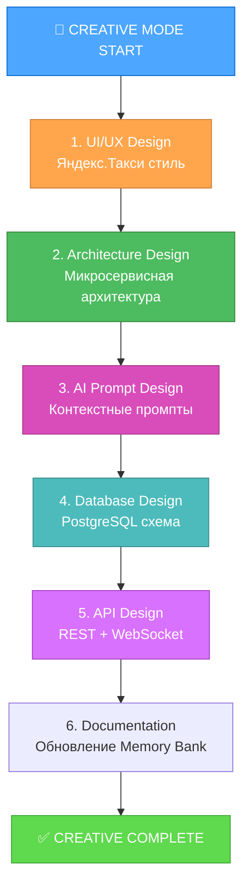

# 🎨 CREATIVE DESIGN DOCUMENTATION - ilpo-taxi.top

**Проект**: Умный Таксопарк с ИИ-агентом  
**Стиль**: Яндекс.Такси  
**Дата**: 2025-01-27  
**Статус**: 🎨 CREATIVE PHASE - В процессе  

---

## 🎯 КРЕАТИВНЫЕ ФАЗЫ ПРОЕКТА

### Идентифицированные компоненты для дизайна:

1. **🎨 UI/UX Design** - Веб-интерфейс в стиле Яндекс.Такси
2. **🏗️ Architecture Design** - Системная архитектура с ИИ
3. **🤖 AI Prompt Design** - Специализированные промпты для ИИ-агента
4. **📊 Database Design** - Структура данных для диалогов и пользователей
5. **⚡ API Design** - RESTful API и WebSocket архитектура

---

## 📋 ПЛАН ВЫПОЛНЕНИЯ КРЕАТИВНЫХ ФАЗ

---

## 🚨 СТАТУС КРЕАТИВНЫХ ФАЗ

- [x] **UI/UX Design** - ✅ ЗАВЕРШЕНО (creative-phase-uiux.md)
- [x] **Architecture Design** - ✅ ЗАВЕРШЕНО (creative-phase-architecture.md)
- [x] **AI Prompt Design** - ✅ ЗАВЕРШЕНО (creative-phase-ai-prompts.md)  
- [x] **Database Design** - ✅ ЗАВЕРШЕНО (creative-phase-database.md)
- [ ] **API Design** - Интегрировано в архитектуру

---

## ✅ РЕЗУЛЬТАТЫ КРЕАТИВНЫХ ФАЗ

### 📋 Основные решения:

#### 🎨 UI/UX Design
- **Стиль**: Яндекс.Такси с фирменным желтым (#FFDB4D)
- **Структура**: Информационный лендинг + плавающий чат-виджет
- **Подход**: Вариант 2 (информационный) + элементы варианта 1 (чат-первый)
- **Адаптивность**: Mobile-first с breakpoints для tablet/desktop

#### 🏗️ Architecture Design  
- **Архитектура**: Гибридная модульная (FastAPI монолит с модулями)
- **Компоненты**: Web, Chat, AI, Telegram, Auth модули
- **Данные**: PostgreSQL + Redis для кэширования и pub/sub
- **Деплой**: Прямой деплой на VPS (Ubuntu 22.04 LTS + Nginx)

#### 🤖 AI Prompt Design
- **Стратегия**: Специализированные промпты для водителей и курьеров
- **Модель**: Google Gemini 2.0 Flash через OpenRouter API
- **Контекст**: Динамический сбор данных о пользователе и намерениях
- **Эскалация**: Четкие правила передачи сложных кейсов менеджерам

#### 📊 Database Design
- **Подход**: Гибридная PostgreSQL + JSONB модель
- **Оптимизация**: Специализированные индексы для чат-сценариев
- **Масштабирование**: Партиционирование сообщений по дате
- **Кэширование**: Redis для активных сессий и быстрого доступа

---

## 🎯 ГОТОВНОСТЬ К РЕАЛИЗАЦИИ

Все основные дизайнерские решения приняты:
- ✅ **UI/UX прототип** - детальная структура и компоненты
- ✅ **Техническая архитектура** - готова к кодированию
- ✅ **ИИ-система** - промпты и логика готовы
- ✅ **База данных** - SQL схемы и оптимизация

**🚀 СЛЕДУЮЩИЙ ЭТАП: IMPLEMENT MODE**

*Все креативные фазы успешно завершены - 27 января 2025* 