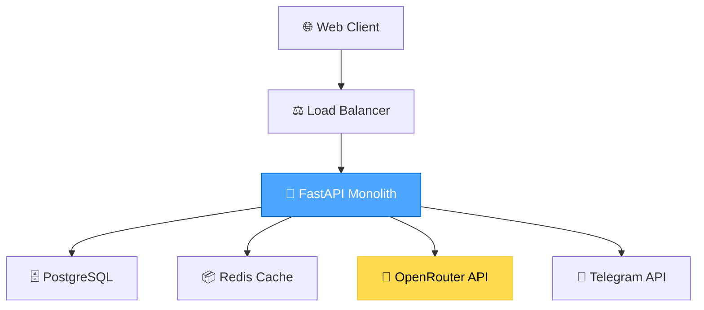
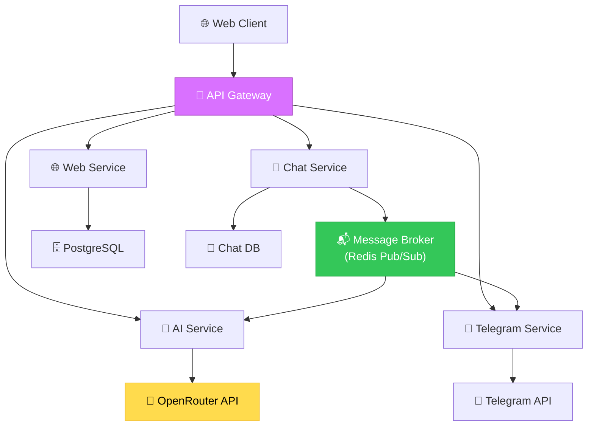
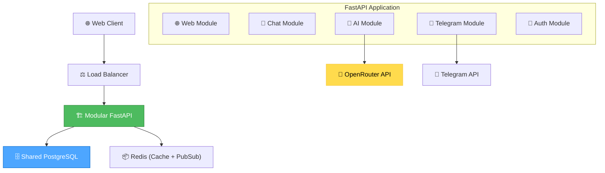
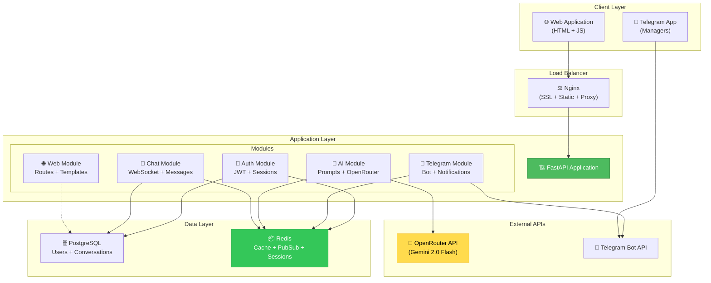
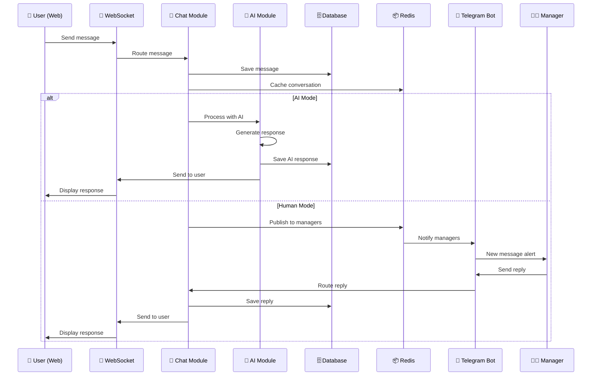
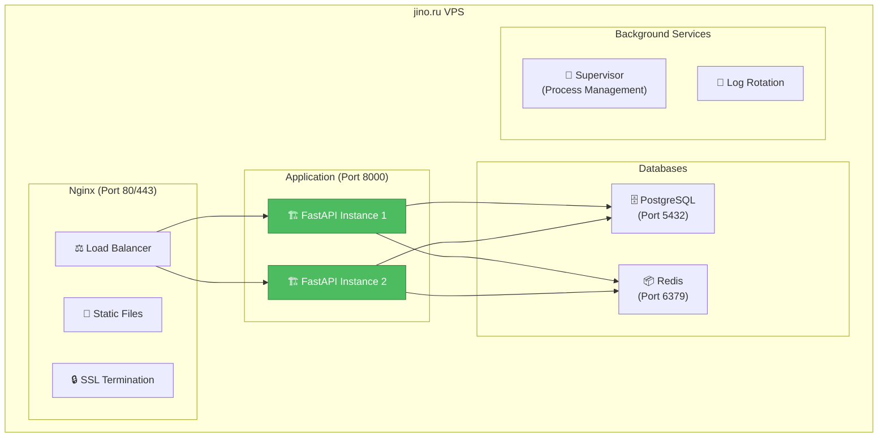

# 🏗️ CREATIVE PHASE: ARCHITECTURE DESIGN - ilpo-taxi.top

**Тип фазы**: Architecture Design  
**Фокус**: Микросервисная архитектура с ИИ-агентом  
**Цель**: Проектирование масштабируемой системы реального времени  
**Дата**: 2025-01-27  

---

## 🎯 ОПРЕДЕЛЕНИЕ АРХИТЕКТУРНОЙ ЗАДАЧИ

### Основные вызовы
1. **Real-time коммуникация** - WebSocket + HTTP API для чата
2. **ИИ-интеграция** - надежная связь с OpenRouter API
3. **Telegram Bot** - синхронизация менеджеров с веб-чатом
4. **Масштабирование** - готовность к росту нагрузки
5. **Отказоустойчивость** - high availability системы

### Архитектурные требования
- **Латентность ИИ ответов**: < 3 секунд
- **Пропускная способность**: 100+ одновременных диалогов
- **Uptime**: 99.9%
- **Масштабирование**: горизонтальное
- **Безопасность**: шифрование данных, API rate limiting

---

## 🔍 ВАРИАНТЫ АРХИТЕКТУРЫ

### ВАРИАНТ 1: Монолитная архитектура
**Описание**: Единое FastAPI приложение со всей логикой



**Компоненты:**
- Один FastAPI сервер
- PostgreSQL для персистентности
- Redis для сессий и кэша
- WebSocket для real-time
- Background tasks для ИИ

**Плюсы:**
- Простота разработки и деплоя
- Быстрая начальная разработка
- Единая кодовая база
- Простая отладка

**Минусы:**
- Сложность масштабирования
- Один point of failure
- Coupling компонентов
- Ограничения по производительности

**Сложность**: Низкая  
**Время реализации**: 2-3 недели

---

### ВАРИАНТ 2: Микросервисная архитектура
**Описание**: Разделение на специализированные сервисы



**Сервисы:**
1. **Web Service** - статика + основная логика сайта
2. **Chat Service** - управление диалогами + WebSocket
3. **AI Service** - интеграция с OpenRouter + промпт-инжиниринг
4. **Telegram Service** - бот для менеджеров + уведомления
5. **API Gateway** - маршрутизация + аутентификация

**Плюсы:**
- Независимое масштабирование сервисов
- Изоляция отказов
- Технологическое разнообразие
- Команды могут работать независимо

**Минусы:**
- Высокая сложность
- Network latency между сервисами
- Distributed transactions
- Сложность отладки

**Сложность**: Высокая  
**Время реализации**: 5-6 недель

---

### ВАРИАНТ 3: Гибридная модульная архитектура
**Описание**: Монолит с четкими модулями и возможностью выделения сервисов



**Модули:**
- **Web Module** - роутеры для сайта + статика
- **Chat Module** - WebSocket + управление диалогами
- **AI Module** - промпты + интеграция OpenRouter
- **Telegram Module** - бот логика + уведомления
- **Auth Module** - аутентификация менеджеров

**Плюсы:**
- Модульность без overhead микросервисов
- Простота разработки и деплоя
- Возможность миграции к микросервисам
- Четкое разделение ответственности

**Минусы:**
- Все еще shared database
- Ограниченное независимое масштабирование
- Потенциальный coupling

**Сложность**: Средняя  
**Время реализации**: 3-4 недели

---

## ⚖️ ОЦЕНКА АРХИТЕКТУР

### Критерии оценки
1. **Производительность** (25%)
2. **Масштабируемость** (25%)
3. **Простота разработки** (20%)
4. **Отказоустойчивость** (15%)
5. **Время выхода на рынок** (15%)

### Сравнительная таблица
| Критерий | Монолит | Микросервисы | Гибридная |
|----------|---------|--------------|-----------|
| Производительность | 7/10 | 9/10 | 8/10 |
| Масштабируемость | 4/10 | 10/10 | 7/10 |
| Простота разработки | 9/10 | 4/10 | 8/10 |
| Отказоустойчивость | 5/10 | 9/10 | 7/10 |
| Time to Market | 9/10 | 4/10 | 8/10 |
| **ИТОГО** | **6.7/10** | **7.1/10** | **7.6/10** |

---

## ✅ РЕКОМЕНДУЕМАЯ АРХИТЕКТУРА

### Выбранный подход: **ГИБРИДНАЯ МОДУЛЬНАЯ АРХИТЕКТУРА**

**Обоснование:**
1. **Оптимальный баланс** сложности и функциональности
2. **Быстрый выход на рынок** - 3-4 недели разработки  
3. **Путь миграции** - возможность выделения сервисов в будущем
4. **Подходит для команды** - не требует DevOps экспертизы

---

## 🏗️ ДЕТАЛЬНАЯ АРХИТЕКТУРА

### Общая схема системы



---

## 📊 DATABASE DESIGN

### PostgreSQL Schema

```sql
-- Пользователи (потенциальные водители/курьеры)
CREATE TABLE users (
    id SERIAL PRIMARY KEY,
    phone VARCHAR(20) UNIQUE,
    name VARCHAR(100),
    email VARCHAR(255),
    user_type VARCHAR(20), -- 'driver' | 'courier'
    status VARCHAR(20) DEFAULT 'new', -- 'new' | 'processing' | 'approved' | 'rejected'
    created_at TIMESTAMP DEFAULT NOW(),
    updated_at TIMESTAMP DEFAULT NOW()
);

-- Менеджеры таксопарка
CREATE TABLE managers (
    id SERIAL PRIMARY KEY,
    telegram_id BIGINT UNIQUE,
    name VARCHAR(100),
    username VARCHAR(50),
    is_active BOOLEAN DEFAULT true,
    created_at TIMESTAMP DEFAULT NOW()
);

-- Диалоги (сессии чата)
CREATE TABLE conversations (
    id UUID PRIMARY KEY DEFAULT gen_random_uuid(),
    user_id INTEGER REFERENCES users(id),
    manager_id INTEGER REFERENCES managers(id),
    status VARCHAR(20) DEFAULT 'active', -- 'active' | 'closed' | 'transferred'
    started_at TIMESTAMP DEFAULT NOW(),
    ended_at TIMESTAMP,
    ai_mode BOOLEAN DEFAULT true -- true = AI, false = human
);

-- Сообщения
CREATE TABLE messages (
    id SERIAL PRIMARY KEY,
    conversation_id UUID REFERENCES conversations(id),
    sender_type VARCHAR(10), -- 'user' | 'ai' | 'manager'
    sender_id INTEGER, -- user_id or manager_id
    content TEXT NOT NULL,
    message_type VARCHAR(20) DEFAULT 'text', -- 'text' | 'system' | 'transfer'
    created_at TIMESTAMP DEFAULT NOW()
);

-- Индексы для производительности
CREATE INDEX idx_conversations_user_id ON conversations(user_id);
CREATE INDEX idx_conversations_status ON conversations(status);
CREATE INDEX idx_messages_conversation_id ON messages(conversation_id);
CREATE INDEX idx_messages_created_at ON messages(created_at);
```

### Redis Structure

```python
# Структуры данных в Redis

# 1. Активные WebSocket соединения
websocket_connections = {
    "ws:{conversation_id}": "connection_object"
}

# 2. Кэш диалогов (для быстрого доступа)
conversation_cache = {
    "conv:{conversation_id}": {
        "user_id": "user_id",
        "manager_id": "manager_id", 
        "ai_mode": True,
        "last_activity": "timestamp"
    }
}

# 3. Очередь сообщений для ИИ
ai_queue = {
    "ai:queue": ["message_1", "message_2", "..."]
}

# 4. Pub/Sub каналы
pubsub_channels = {
    "chat:{conversation_id}": "new_message_event",
    "managers:notifications": "new_conversation_alert"
}

# 5. Сессии менеджеров
manager_sessions = {
    "session:{telegram_id}": {
        "active_conversations": ["conv_id_1", "conv_id_2"],
        "status": "online|offline",
        "last_seen": "timestamp"
    }
}
```

---

## 🔄 DATA FLOW АРХИТЕКТУРА

### Real-time Message Flow



---

## 🚀 DEPLOYMENT АРХИТЕКТУРА

### Production Setup



### VPS Deployment Setup

```bash
# Прямая установка на Ubuntu 22.04 LTS
# 1. Установка зависимостей
sudo apt update && sudo apt upgrade -y
sudo apt install python3.11 python3.11-venv nginx postgresql-14 redis-server

# 2. Настройка Python окружения
python3.11 -m venv /opt/ilpo-taxi/venv
source /opt/ilpo-taxi/venv/bin/activate
pip install -r requirements.txt

# 3. Настройка PostgreSQL
sudo -u postgres createdb ilpo_taxi
sudo -u postgres createuser ilpo_user

# 4. Настройка systemd сервиса
sudo systemctl enable ilpo-taxi
sudo systemctl enable nginx
sudo systemctl enable postgresql
sudo systemctl enable redis-server

# 5. SSL сертификат через Let's Encrypt
sudo apt install certbot python3-certbot-nginx
sudo certbot --nginx -d ilpo-taxi.top
```

---

## 🔒 БЕЗОПАСНОСТЬ

### API Security

```python
# Аутентификация и авторизация
from fastapi_limiter import FastAPILimiter
from fastapi_limiter.depends import RateLimiter

# Rate limiting для API
@app.middleware("http")
async def rate_limit_middleware(request: Request, call_next):
    return await RateLimiter(times=100, seconds=60)(request, call_next)

# CORS настройки  
app.add_middleware(
    CORSMiddleware,
    allow_origins=["https://ilpo-taxi.top"],
    allow_credentials=True,
    allow_methods=["GET", "POST"],
    allow_headers=["*"],
)

# Input validation
from pydantic import BaseModel, validator

class MessageInput(BaseModel):
    content: str
    
    @validator('content')
    def validate_content(cls, v):
        if len(v.strip()) < 1:
            raise ValueError('Message cannot be empty')
        if len(v) > 4000:
            raise ValueError('Message too long')
        return v.strip()
```

### Data Protection

- **Шифрование в покое**: PostgreSQL + Redis TLS
- **Шифрование в транзите**: HTTPS/WSS + SSL сертификаты  
- **API ключи**: Environment variables + rotation
- **Личные данные**: минимизация сбора + GDPR compliance

---

## 📈 МОНИТОРИНГ И МЕТРИКИ

### Application Metrics

```python
# Prometheus метрики
from prometheus_fastapi_instrumentator import Instrumentator

# Кастомные метрики
MESSAGE_COUNTER = Counter('messages_total', 'Total messages', ['type'])
AI_RESPONSE_TIME = Histogram('ai_response_duration_seconds', 'AI response time')
ACTIVE_CONVERSATIONS = Gauge('active_conversations', 'Active conversations count')

# WebSocket метрики
WS_CONNECTIONS = Gauge('websocket_connections', 'Active WebSocket connections')
```

### Health Checks

```python
@app.get("/health")
async def health_check():
    """Комплексная проверка здоровья системы"""
    checks = {
        "database": await check_database(),
        "redis": await check_redis(),
        "openrouter": await check_openrouter_api(),
        "telegram": await check_telegram_api()
    }
    
    status = "healthy" if all(checks.values()) else "unhealthy"
    return {"status": status, "checks": checks}
```

---

## 🔧 ТЕХНИЧЕСКИЕ РЕШЕНИЯ

### WebSocket Management

```python
from fastapi import WebSocket
import asyncio
import json

class ConnectionManager:
    """Управление WebSocket соединениями"""
    
    def __init__(self):
        self.active_connections: Dict[str, WebSocket] = {}
        
    async def connect(self, websocket: WebSocket, conversation_id: str):
        await websocket.accept()
        self.active_connections[conversation_id] = websocket
        
    async def disconnect(self, conversation_id: str):
        if conversation_id in self.active_connections:
            del self.active_connections[conversation_id]
            
    async def send_message(self, conversation_id: str, message: dict):
        if conversation_id in self.active_connections:
            websocket = self.active_connections[conversation_id]
            await websocket.send_text(json.dumps(message))
```

### AI Integration

```python
import aiohttp
from typing import AsyncGenerator

class AIService:
    """Интеграция с OpenRouter API"""
    
    def __init__(self, api_key: str):
        self.api_key = api_key
        self.base_url = "https://openrouter.ai/api/v1"
        
    async def generate_response(self, 
                              conversation_history: List[dict],
                              context: str) -> str:
        """Генерация ответа от ИИ"""
        
        prompt = self._build_prompt(conversation_history, context)
        
        async with aiohttp.ClientSession() as session:
            async with session.post(
                f"{self.base_url}/chat/completions",
                headers={
                    "Authorization": f"Bearer {self.api_key}",
                    "Content-Type": "application/json"
                },
                json={
                    "model": "google/gemini-2.0-flash-001",
                    "messages": prompt,
                    "max_tokens": 1000,
                    "temperature": 0.7
                }
            ) as response:
                data = await response.json()
                return data["choices"][0]["message"]["content"]
                
    def _build_prompt(self, history: List[dict], context: str) -> List[dict]:
        """Построение промпта с контекстом таксопарка"""
        system_prompt = {
            "role": "system",
            "content": f"""
            Вы - ИИ-консультант умного таксопарка для подключения к Яндекс.Такси.
            
            Контекст: {context}
            
            Ваша задача: помочь водителям и курьерам подключиться к платформе.
            Отвечайте дружелюбно, профессионально и по существу.
            """
        }
        
        return [system_prompt] + history
```

---

## ✅ ВЕРИФИКАЦИЯ АРХИТЕКТУРЫ

### Соответствие требованиям ✅
- [x] **Латентность ИИ**: < 3 сек (WebSocket + async processing)
- [x] **Пропускная способность**: 100+ диалогов (connection pooling + Redis)
- [x] **Uptime**: 99.9% (load balancer + health checks)
- [x] **Масштабирование**: горизонтальное (stateless FastAPI instances)
- [x] **Безопасность**: HTTPS + rate limiting + input validation

### Готовность к развитию ✅
- [x] **Модульная структура** - легко выделить микросервисы
- [x] **API-first подход** - готовность к мобильным приложениям
- [x] **Мониторинг** - Prometheus метрики + health checks
- [x] **CI/CD готовность** - VPS deployment + environment configs

---

🎨 **CREATIVE CHECKPOINT**: Архитектура системы спроектирована

**Ключевые решения:**
1. **Гибридная модульная архитектура** FastAPI
2. **PostgreSQL + Redis** для данных и кэша
3. **WebSocket** для real-time коммуникации
4. **Прямой деплой на VPS** без контейнеризации

🎨🎨🎨 **EXITING CREATIVE PHASE: ARCHITECTURE DESIGN** 🎨🎨🎨

**Результат**: Детальная техническая архитектура готова к реализации 