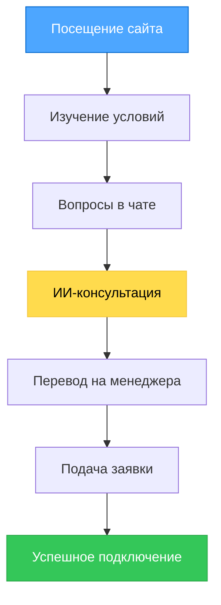
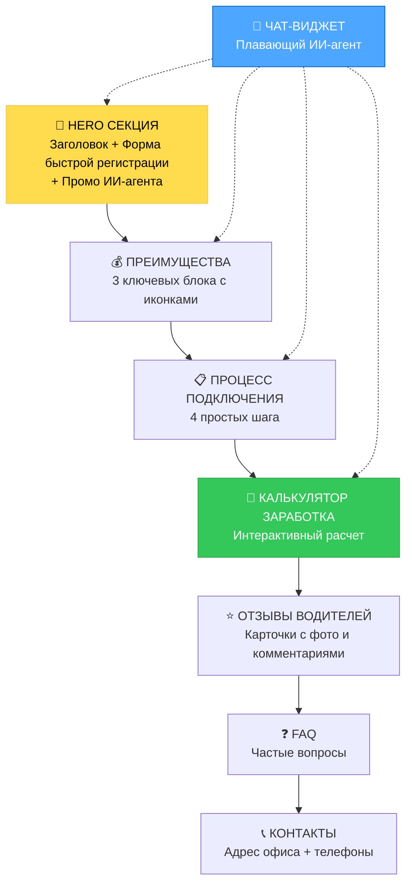

# 🎨 CREATIVE PHASE: UI/UX DESIGN - ilpo-taxi.top

**Тип фазы**: UI/UX Design  
**Фокус**: Веб-интерфейс в стиле Яндекс.Такси  
**Цель**: Создание интуитивного интерфейса для подключения к такси  
**Дата**: 2025-01-27  

---

## 🎯 ОПРЕДЕЛЕНИЕ ПРОБЛЕМЫ

### Основная задача
Создать веб-интерфейс для "Умного Таксопарка", который:
- Привлекает водителей и курьеров к подключению к Яндекс.Такси
- Обеспечивает круглосуточную поддержку через ИИ-агента
- Предоставляет быстрое переключение на живых менеджеров
- Отражает доверие и профессионализм бренда Яндекс.Такси

### Требования к интерфейсу
1. **Простота регистрации** - интуитивный процесс подключения
2. **Доверие** - профессиональный дизайн в стиле Яндекс.Такси
3. **Доступность ИИ** - выделенный чат-виджет
4. **Мобильная адаптивность** - работа на всех устройствах
5. **Быстрая загрузка** - оптимизированная производительность

---

## 👥 АНАЛИЗ ПОЛЬЗОВАТЕЛЕЙ

### Основные persona
1. **Потенциальный водитель** (30-50 лет)
   - Хочет стабильный заработок
   - Ищет понятные условия
   - Нуждается в поддержке при подключении

2. **Курьер** (20-35 лет)
   - Активный пользователь мобильных устройств  
   - Ценит скорость процессов
   - Важна гибкость графика

3. **Менеджер таксопарка** (25-45 лет)
   - Использует систему для ответов клиентам
   - Нужны уведомления о новых диалогах
   - Важна эффективность работы

### User Journey


---

## 🎨 ИССЛЕДОВАНИЕ UI ПАТТЕРНОВ

### Анализ Яндекс.Такси
**Ключевые элементы дизайна:**
- Фирменный желтый (#FFDB4D) как основной акцент
- Минималистичный подход с четкой типографикой
- Скругленные углы для дружелюбности
- Использование карточек для группировки контента
- Четкие CTA-кнопки с высоким контрастом

### Best Practices для таксопарков
- Отзывы водителей на главной странице
- Калькулятор заработка
- FAQ секция
- Контактная информация на видном месте
- Мобильная оптимизация

---

## 🔍 ВАРИАНТЫ РЕШЕНИЙ

### ВАРИАНТ 1: Лендинг + Чат-первый подход
**Описание**: Главная страница фокусируется на чат-виджете как основном способе взаимодействия

**Структура:**
```
Hero секция с ИИ-чатом
↓
Краткие преимущества (3 блока)
↓  
Отзывы водителей
↓
FAQ + Контакты
```

**Плюсы:**
- Сразу демонстрирует главную фичу (ИИ-агент)
- Низкий барьер входа
- Персонализированное взаимодействие
- Высокая конверсия в диалог

**Минусы:**
- Может отпугнуть пользователей, предпочитающих изучить информацию
- Требует качественного ИИ с первого дня
- Сложность в SEO-оптимизации

**Сложность**: Средняя  
**Время реализации**: 2-3 недели

---

### ВАРИАНТ 2: Информационный + Чат поддержка  
**Описание**: Классический лендинг с подробной информацией и чатом как дополнением

**Структура:**
```
Hero с формой регистрации
↓
Подробные условия и преимущества
↓
Процесс подключения (пошагово)
↓
Калькулятор заработка
↓
Отзывы и контакты
↓
Чат-виджет (плавающий)
```

**Плюсы:**
- Полная информация для принятия решения
- SEO-дружественная структура
- Подходит для разных типов пользователей
- Четкий процесс конверсии

**Минусы:**
- Может показаться обычным сайтом таксопарка
- ИИ-агент не выделяется как USP
- Длинная страница может снизить конверсию

**Сложность**: Низкая  
**Время реализации**: 1-2 недели

---

### ВАРИАНТ 3: Гибридный интерактивный подход
**Описание**: Совмещение информационности с интерактивным ИИ-гидом

**Структура:**
```
Hero с ИИ-приветствием
↓
Интерактивные секции (ИИ помогает навигации)
↓
Персонализированные условия (через ИИ)
↓
Умный калькулятор с ИИ-советами
↓
Онлайн-подача заявки через ИИ
```

**Плюсы:**
- Уникальный пользовательский опыт
- ИИ-агент интегрирован во весь процесс
- Высокая вовлеченность пользователей
- Демонстрация инновационности

**Минусы:**
- Высокая сложность разработки
- Требует продвинутого ИИ
- Риск технических проблем
- Может быть избыточным для простых задач

**Сложность**: Высокая  
**Время реализации**: 4-5 недель

---

## ⚖️ ОЦЕНКА ВАРИАНТОВ

### Критерии оценки
1. **Пользовательский опыт** (30%)
2. **Техническая сложность** (20%)
3. **Время разработки** (20%)
4. **Уникальность/инновация** (15%)
5. **SEO и маркетинг** (15%)

### Сравнительная таблица
| Критерий | Вариант 1 | Вариант 2 | Вариант 3 |
|----------|-----------|-----------|-----------|
| UX | 8/10 | 7/10 | 9/10 |
| Техсложность | 6/10 | 9/10 | 3/10 |
| Время | 7/10 | 9/10 | 4/10 |
| Инновация | 8/10 | 5/10 | 10/10 |
| SEO/Маркетинг | 6/10 | 9/10 | 7/10 |
| **ИТОГО** | **7.1/10** | **7.6/10** | **6.7/10** |

---

## ✅ РЕКОМЕНДУЕМОЕ РЕШЕНИЕ

### Выбранный подход: **ВАРИАНТ 2 + элементы ВАРИАНТА 1**

**Обоснование:**
1. **Оптимальный баланс** между информативностью и инновацией
2. **Реалистичные сроки** разработки (2-3 недели)
3. **SEO-оптимизация** для привлечения органического трафика
4. **Гибкость развития** - можно добавить интерактивные элементы позже

### Финальная структура сайта:



---

## 📐 ДИЗАЙН-СИСТЕМА КОМПОНЕНТОВ

### Hero секция
```css
.hero {
  background: linear-gradient(135deg, #FFDB4D 0%, #F5C842 100%);
  padding: 80px 0;
  text-align: center;
}

.hero-title {
  font-size: 48px;
  font-weight: 500;
  color: #21201F;
  margin-bottom: 24px;
}

.hero-subtitle {
  font-size: 20px;
  color: #404040;
  margin-bottom: 40px;
}
```

### Карточки преимуществ
```css
.benefit-card {
  background: #FFFFFF;
  border-radius: 16px;
  padding: 32px;
  text-align: center;
  box-shadow: 0 4px 16px rgba(33, 32, 31, 0.08);
  transition: transform 0.3s ease;
}

.benefit-card:hover {
  transform: translateY(-8px);
}

.benefit-icon {
  width: 64px;
  height: 64px;
  background: #FFF3A0;
  border-radius: 50%;
  margin: 0 auto 20px;
}
```

### Чат-виджет (расширенный)
```css
.chat-widget {
  position: fixed;
  bottom: 24px;
  right: 24px;
  width: 400px;
  height: 600px;
  background: #FFFFFF;
  border-radius: 20px;
  box-shadow: 0 12px 48px rgba(33, 32, 31, 0.2);
  border: 2px solid #FFDB4D;
  overflow: hidden;
  z-index: 1000;
  transition: all 0.3s ease;
}

.chat-widget.minimized {
  height: 80px;
  width: 320px;
}

.chat-toggle {
  background: linear-gradient(135deg, #FFDB4D 0%, #F5C842 100%);
  border: none;
  border-radius: 50%;
  width: 64px;
  height: 64px;
  position: fixed;
  bottom: 24px;
  right: 24px;
  box-shadow: 0 4px 16px rgba(255, 219, 77, 0.4);
  cursor: pointer;
  z-index: 1001;
}
```

---

## 📱 АДАПТИВНОСТЬ

### Мобильная версия (< 768px)
- Hero высота уменьшается до 60px padding
- Карточки преимуществ в одну колонку
- Чат-виджет занимает 90% ширины экрана
- Упрощенная форма регистрации

### Планшет (768px - 1024px)
- Двухколоночная сетка для преимуществ
- Чат-виджет остается фиксированным
- Оптимизированная типографика

### Desktop (> 1024px)
- Трехколоночная сетка
- Полнофункциональный чат-виджет
- Расширенные анимации

---

## ♿ ДОСТУПНОСТЬ

### WCAG 2.1 AA соответствие
- Контрастность текста ≥ 4.5:1
- Клавиатурная навигация для всех элементов
- Alt-тексты для изображений
- ARIA-метки для интерактивных элементов
- Фокус-индикаторы с высоким контрастом

### Screenreader поддержка
```html
<button aria-label="Открыть чат с ИИ-консультантом" 
        aria-expanded="false" 
        aria-controls="chat-widget">
  💬 ИИ-Консультант
</button>
```

---

## 🔧 ТЕХНИЧЕСКАЯ РЕАЛИЗАЦИЯ

### Frontend Stack
- **HTML5** семантическая разметка
- **Bootstrap 5+** для UI компонентов
- **SCSS** для кастомизации Bootstrap
- **JavaScript ES6+** для интерактивности

### Производительность
- Лейзи-лоадинг для изображений
- Минификация CSS/JS
- WebP изображения с fallback
- Критический CSS inline

### SEO оптимизация
```html
<meta name="description" content="Первый умный таксопарк с ИИ-агентом. Подключайтесь к Яндекс.Такси за 24 часа. Круглосуточная поддержка ИИ-консультанта.">
<meta property="og:title" content="Умный Таксопарк - ilpo-taxi.top">
<script type="application/ld+json">
{
  "@context": "https://schema.org",
  "@type": "Organization",
  "name": "Умный Таксопарк",
  "url": "https://ilpo-taxi.top"
}
</script>
```

---

## ✅ ВЕРИФИКАЦИЯ ПРОТИВ ТРЕБОВАНИЙ

### Основные требования ✅
- [x] **Простота регистрации** - форма в Hero + чат
- [x] **Доверие** - фирменный стиль Яндекс.Такси
- [x] **Доступность ИИ** - выделенный чат-виджет
- [x] **Мобильная адаптивность** - респонсивный дизайн
- [x] **Быстрая загрузка** - оптимизированная производительность

### Соответствие Style Guide ✅
- [x] Цвета из фирменной палитры Яндекс.Такси
- [x] Типографика YS Text
- [x] Интервалы кратны 4px
- [x] Скругления по системе
- [x] Анимации ≤ 300ms

---

🎨 **CREATIVE CHECKPOINT**: UI/UX дизайн структуры определен

**Следующие шаги:**
1. Создание детальных макетов
2. Прототипирование чат-виджета
3. Тестирование мобильной версии
4. Интеграция с backend API

🎨🎨🎨 **EXITING CREATIVE PHASE: UI/UX DESIGN** 🎨🎨🎨

**Результат**: Детальный план UI/UX в стиле Яндекс.Такси с фокусом на ИИ-чат и конверсию в регистрацию 